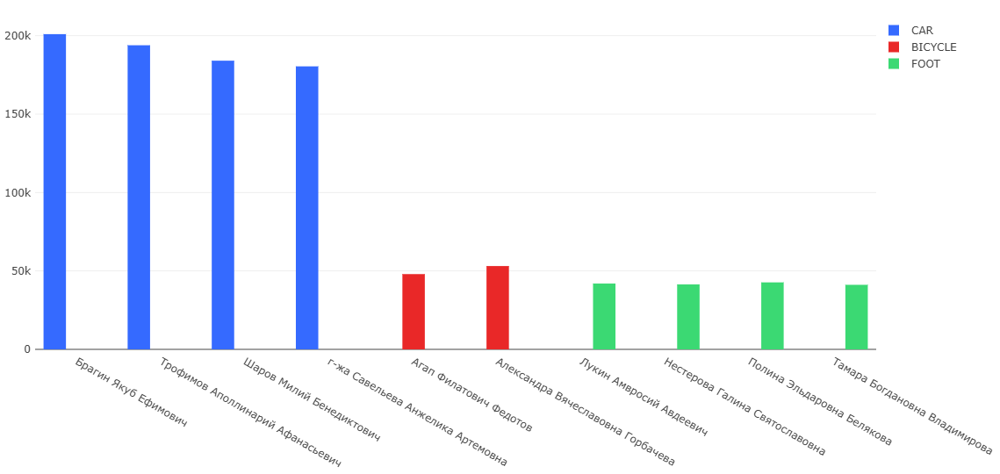
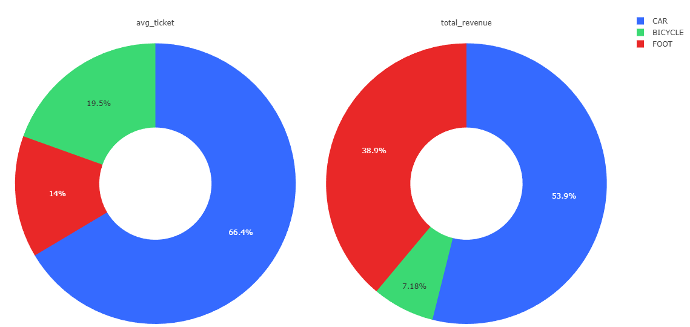
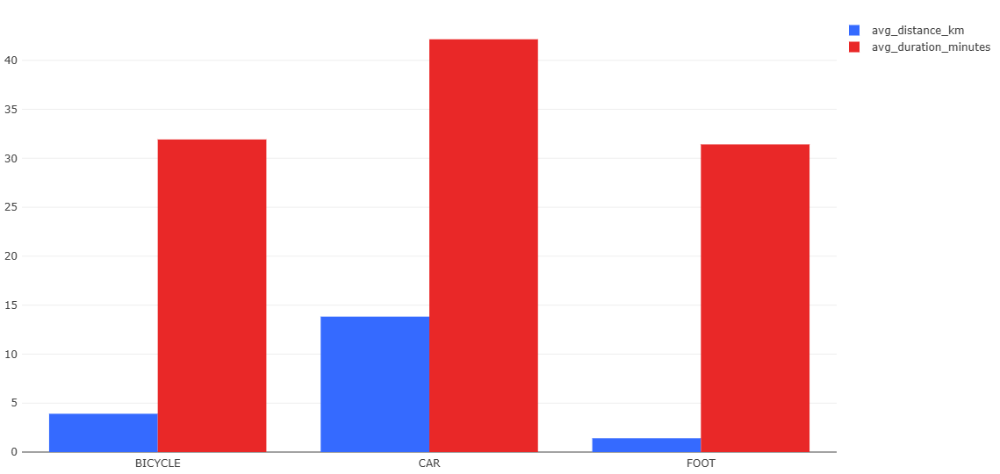
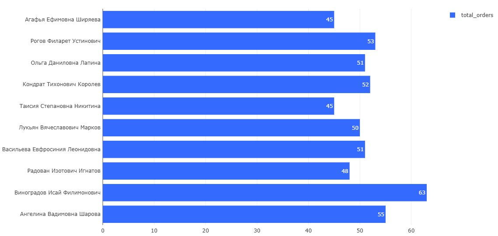
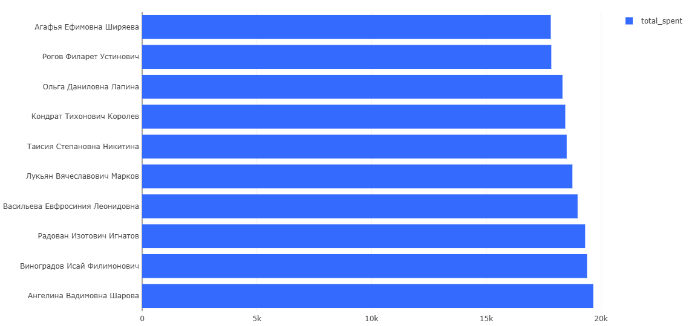
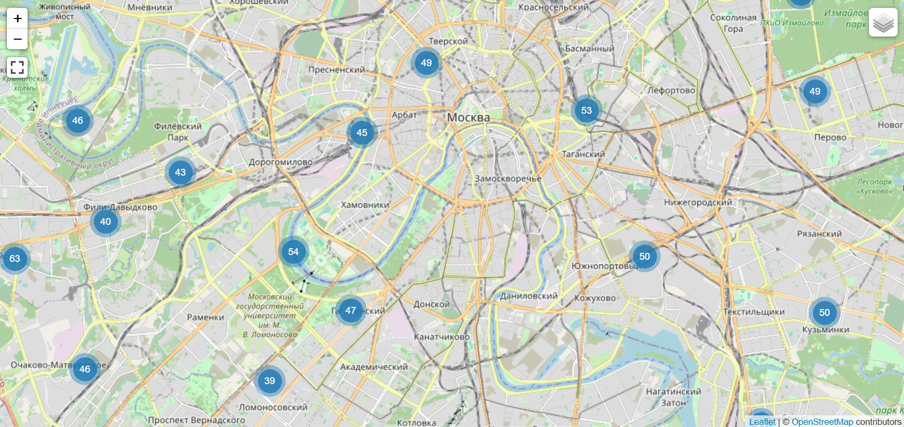

# Delivery System Analytics: End-to-End система симуляции доставки


Полнофункциональная система для генерации, хранения и аналитики данных службы доставки в реальном времени. Проект симулирует работу курьерской службы в г. Москва, генерируя "живые" данные с учетом географии, типов транспорта и финансовых показателей.

---

## 📋 Особенности проекта

### 1. Генерация данных (Simulation Engine)
Вместо случайных чисел используется логика симуляции:
*   **География:** Все адреса генерируются строго внутри МКАД (г. Москва) с реальными координатами.
*   **Логистика:**
    *   🚗 **Авто-курьеры:** Берут заказы на дальние расстояния (от 3 до 25 км).
    *   🚲 **Вело-курьеры:** Средние дистанции (1 - 7 км).
    *   🏃 **Пешие курьеры:** Работают локально (до 2.5 км).
*   **Экономика:** Стоимость заказа рассчитывается динамически: `База + (Км * Ставка_Транспорта) * Коэффициент_Спроса`.
*   **Время:** Все сервисы синхронизированы по часовому поясу `Europe/Moscow`.

### 2. Полная автоматизация (Zero-Config)
Вся инфраструктура разворачивается одной командой.
*   **Auto-Migration:** При старте автоматически создаются структуры таблиц в PostgreSQL.
*   **Redash Init:** Специальный контейнер автоматически инициализирует базу данных Redash, избавляя от ручной настройки.
*   **Healthchecks:** Контейнеры ожидают готовности друг друга (Database -> Generator -> Redash), предотвращая ошибки запуска.

### 3. Аналитический дашборд
Настроенный ETL-процесс позволяет визуализировать ключевые метрики бизнеса в Redash.

---

## 🚀 Инструкция по запуску

Для запуска вам понадобятся только **Docker** и **Docker Compose**.

1. **Клонируйте репозиторий:**
   ```bash
   git clone https://github.com/Viktor3911/delivery_system.git
   cd delivery_system
   ```

2. **Запустите систему:**
   ```bash
   docker-compose up --build -d
   ```

3. **Ожидание инициализации:**
   Первый запуск займет около **60-120 секунд**. В это время:
   *   PostgreSQL создает две базы данных (`delivery_db` и `redash_metadata`).
   *   Генератор наполняет город жителями (клиенты/курьеры).
   *   Redash настраивает свои внутренние таблицы.

4. **Доступ к интерфейсам:**
   *   📊 **Redash (Аналитика):** [http://localhost:5000](http://localhost:5000)
   *   🗄️ **База данных:** `localhost:5432`
       *   *User:* `delivery_user`
       *   *Password:* `delivery_pass`
       *   *DB:* `delivery_db`

---

## 📊 Примеры аналитики (Скриншоты)

В Redash реализован дашборд c визуализациями для сгенерированных 4500 заказов.

### 1. Эффективность персонала (Топ курьеров)
Рейтинг сотрудников по суммарной заработанной выручке. Позволяет выявлять KPI лидеров.


### 2. Финансовый разрез по транспорту
Анализ структуры выручки и среднего чека. Видно, что **Авто-курьеры** приносят большую часть выручки за счет дальних дорогих заказов.


### 3. Операционные метрики (Время и Дистанция)
График подтверждает корректность работы симулятора:
*   **Пешие** делают короткие заказы (синий столбец минимален).
*   **Авто** покрывают огромные расстояния, но тратят больше времени на один заказ.


### 4. Лояльность клиентов (CRM)
Топ пользователей по количеству заказов и общей сумме трат (LTV).



### 5. География покрытия (Heatmap)
Отображение точек доставки на карте Москвы. Позволяет оценить плотность заказов по районам.


---

## 🛠 Технологический стек

| Компонент | Технология | Описание |
|-----------|------------|----------|
| **Язык** | Python 3.11 | Основная логика генератора |
| **ORM** | SQLAlchemy 2.0 | Асинхронная работа с БД |
| **Database** | PostgreSQL 15 | Хранение бизнес-данных и метаданных |
| **Migration** | Alembic | Управление схемой БД |
| **Analytics** | Redash 10 | Визуализация и дашборды |
| **Queue** | Redis 7 | Очереди задач для Redash |
| **Deploy** | Docker Compose | Оркестрация контейнеров |

---

## 📂 Структура проекта

```text
├── delivery_system/            # Исходный код системы
│   ├── db/                     # Слой работы с БД (PostgreSQL)
│   │   ├── alembic/            # Конфигурация и история миграций
│   │   ├── dao/                # Слой доступа к данным (CRUD-логика)
│   │   │   ├── base.py         # Базовый асинхронный DAO
│   │   │   └── ..._dao.py      # DAO для Client, Courier, Order
│   │   ├── models/             # ORM-модели (SQLAlchemy)
│   │   │   ├── base_model.py   # Общие поля (ID, Timestamps)
│   │   │   ├── enums.py        # Перечисления (TransportType, Status)
│   │   │   └── ..._model.py    # Модели сущностей
│   │   ├── meta.py             # Метаданные БД
│   │   └── utils.py            # Авто-инициализация БД и миграций
│   ├── scripts/
│   │   └── redash_queries.sql  # SQL-запросы для Redash
│   ├── services/               # Слой бизнес-логики
│   │   ├── population.py       # Логика первичного наполнения (Faker)
│   │   └── order_maker.py      # Алгоритм симуляции заказов
│   └── generator.py            # Точка входа (Main Loop)
├── alembic.ini                 # Конфиг Alembic
├── docker-compose.yml          # Оркестрация системы (7 сервисов)
├── Dockerfile                  # Инструкции сборки образа генератора
├── requirements.txt            # Зависимости проекта
└── README.md                   # Документация
```
